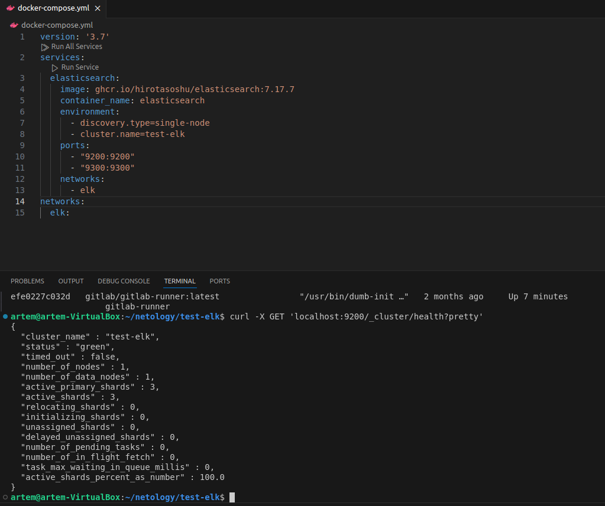
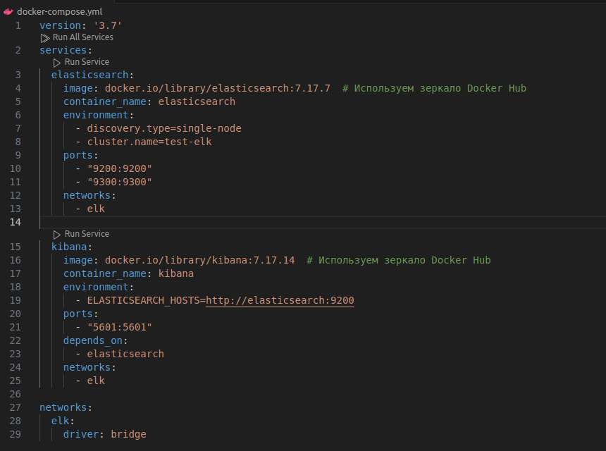
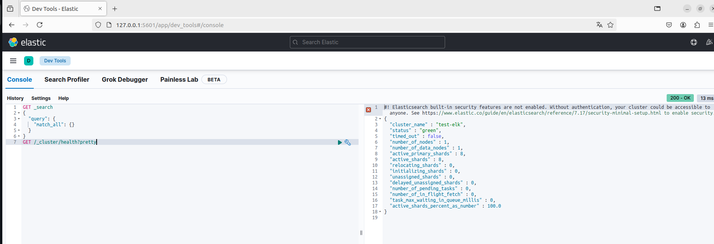
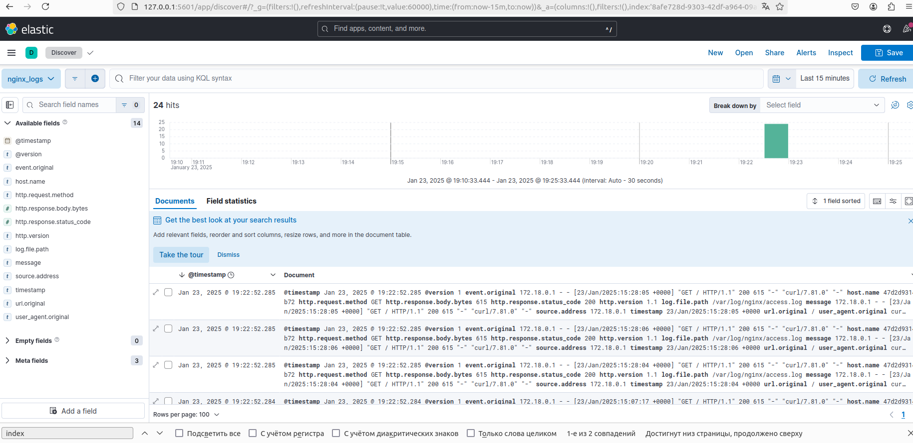
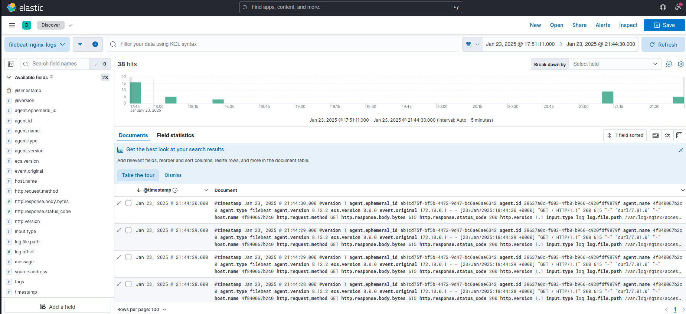

# Домашнее задание к занятию «ELK»

### Задание 1. Elasticsearch 

Установите и запустите Elasticsearch, после чего поменяйте параметр cluster_name на случайный. 

*Приведите скриншот команды 'curl -X GET 'localhost:9200/_cluster/health?pretty', сделанной на сервере с установленным Elasticsearch. Где будет виден нестандартный cluster_name*.

### Решение:

Команды, которые использовал для работы с БД ElasticSearch в Dev Tools  
Получить все индексы с записями:  
`GET _search  
{  
  "query": {  
    "match_all": {}  
  }  
}`   
Получить список индексов:  
`GET _cat/indices`   
Удалить индекс по имени:  
`DELETE *index_name*`  
Работает на порту 9200 

---

### Задание 2. Kibana

Установите и запустите Kibana.

*Приведите скриншот интерфейса Kibana на странице http://<ip вашего сервера>:5601/app/dev_tools#/console, где будет выполнен запрос GET /_cluster/health?pretty*.

### Решение:

---

### Задание 3. Logstash

Установите и запустите Logstash и Nginx. С помощью Logstash отправьте access-лог Nginx в Elasticsearch. 

*Приведите скриншот интерфейса Kibana, на котором видны логи Nginx.*

### Решение:

[logstash.conf](../test-elk/logstash/logstash.conf)
[docker-compose.yml](docker-compose.yml)

docker exec -u root -it logstash bash
chmod -R 777 /var/log/nginx - открыть логсташ возможность читать логи nginx

---

### Задание 4. Filebeat. 

Установите и запустите Filebeat. Переключите поставку логов Nginx с Logstash на Filebeat. 

*Приведите скриншот интерфейса Kibana, на котором видны логи Nginx, которые были отправлены через Filebeat.*

### Решение:

[composeFB](docker-composeFB.yml)
[LogstashDB](logstashFB.conf)
[FilebeatYML](filebeat.yml)

Измените права доступа к файлу filebeat.yml (Для записи только владельцу)- chmod go-w ./filebeat.yml

